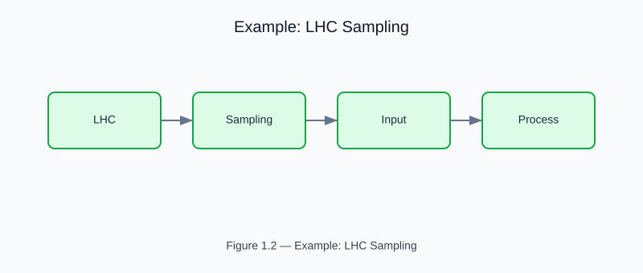

# Example: LHC Sampling

<!-- generated-figure-start -->

*Figure 1.2 — Example: LHC Sampling*
<!-- generated-figure-end -->

**Source**: crates/tyche-core/examples/book_lhc_sampling.rs

Constructs a 2D parameter space (pressure x temperature) and generates 8 deterministic LHC samples.

## Source

```rust
{{#include ../../../crates/tyche-core/examples/book_lhc_sampling.rs}}
```
