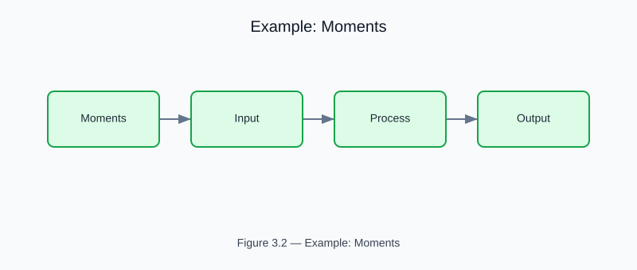

# Example: Online Moments

<!-- generated-figure-start -->

*Figure 3.2 — Example: Moments*
<!-- generated-figure-end -->

**Source**: crates/tyche-core/examples/book_moments.rs

Accumulates Welford-Chan online mean and variance; merges two independent accumulators.

## Source

```rust
{{#include ../../../crates/tyche-core/examples/book_moments.rs}}
```
