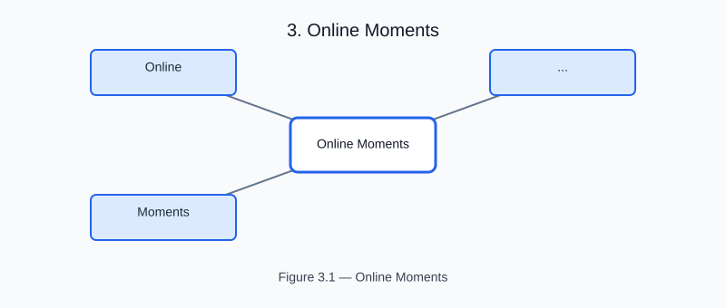

# Online Moments

<!-- generated-figure-start -->

*Figure 3.1 — Online Moments*
<!-- generated-figure-end -->

Tyche's ordered statistics are online accumulators with explicit denominator
policies, so a study never buffers a response history in order to summarize
it. `Moments<T>` tracks a scalar observation stream with the Welford-Chan
recurrence: a running mean and a centered sum of squares that are stable
against cancellation and mergeable across partitions.

## The accumulator

`Moments::new()` starts empty and `update(value)` folds one observation in.
`count()` reports how many observations have arrived, and `is_empty()`
distinguishes a fresh accumulator from one that has seen data.

After any update the running `mean()` and `centered_sum()` are immediately
available, and `variance::<Policy>()` selects the denominator at the type
level.

> **Contract** — `mean()` returns `InsufficientSamples` until at least one
> observation arrives, and each variance policy carries its own
> `MINIMUM_SAMPLES`. `InsufficientSamples` reports both the `required` and
> `actual` counts, so a study can surface exactly how many responses were
> missing.

`PopulationVariance` divides by `n` (minimum one sample) and `SampleVariance`
divides by `n - 1` (minimum two). `VariancePolicy<T>` is the public seam, so
a study can define its own denominator convention without reimplementing a
variance.

## Merging partitions

`merge(other)` combines two accumulators with Chan's recurrence. A Moirai
study that partitions a response stream across workers can reduce per-worker
`Moments` at the boundary and merge them into exactly the moments of the
concatenated stream — no re-reading of history.

## Interpretation

For a deterministic Sobol or Latin-hypercube sweep, `Moments` summarizes a
response's location and spread. The same accumulator over the `f(A)` values
of a Saltelli design provides the variance estimate that the sensitivity
estimators normalize against.

The following is a focused, non-standalone API fragment:

```rust,ignore
use tyche_core::statistics::{Moments, PopulationVariance, SampleVariance};

let mut moments = Moments::new();
moments.update(1.0);
moments.update(2.0);
moments.update(3.0);
assert_eq!(moments.mean()?, 2.0);
assert_eq!(moments.variance::<PopulationVariance>()?, 2.0 / 3.0);
assert_eq!(moments.variance::<SampleVariance>()?, 1.0);
```
