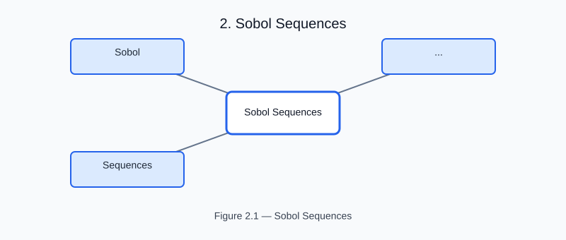

# Sobol Sequences

<!-- generated-figure-start -->

*Figure 2.1 — Sobol Sequences*
<!-- generated-figure-end -->

Tyche's Sobol designs are random-access: any sequence index maps to its
point through a bounded bit loop without replaying earlier points, so a
Moirai-parallel study can assign disjoint index blocks to workers and each
worker can draw its points independently. See ADR 0004 for the design
record.

## The kernel

For point index `n`, let `g(n) = n ^ (n >> 1)` be its Gray code and
`v[d][j]` the direction number for dimension `d` and bit `j`. The canonical
kernel evaluates

`x[n][d] = XOR { v[d][j] | bit j of g(n) is set } / 2^32`.

This is the random-access form of the Bratley-Fox recurrence: consecutive
Gray codes differ in exactly one bit, so the XOR changes by a single
direction number just like the sequential recurrence. Direction parameters
follow Joe and Kuo's notation and the first three dimensions of Algorithm
659.

## Fixed designs

`Sobol<PARAMETERS, S>` is an allocation-free, compile-time-dimensional
design supporting `1..=3` dimensions (`SobolDimensions` enforces this and
reports `SobolDimensionError` otherwise). It is constructed from a validated
`SobolRange` — a contiguous `u32` sequence range — and a compile-time
scramble policy. Ranges that would overflow `u32::MAX` are rejected with
`SobolRangeError`. An origin-aligned, power-of-two prefix
(`is_origin_aligned_power_of_two`) carries the strongest `(t, m, s)` net
balance guarantee.

```rust,ignore
use core::num::NonZeroU32;
use tyche_core::{Design, Sobol, SobolRange, Unscrambled};

let range = SobolRange::new(0, NonZeroU32::new(256).unwrap())?;
let design = Sobol::<3, Unscrambled>::new(range, Unscrambled)?;
let mut point = [0.0; 3];
design.sample_unit_into(7, &mut point)?; // random access: any index
```

## Scrambling

Scrambling is a compile-time policy selected at the design boundary.
`Unscrambled` preserves the canonical points. `DigitalShift<A>` applies one
deterministic base-two digital shift per dimension — an XOR by a fixed
32-bit word derived from a study seed through the counter domain. XOR by a
word is a bijection of dyadic cells at every representable resolution, so it
preserves the point count per cell while moving coordinates reproducibly.
This is a digital shift, not an Owen nested scramble.

## Runtime dimensions

`RuntimeSobol` exposes the same validated kernel through `SobolDimensions`
when the parameter count is not known at compile time; typed
`RuntimeSampleError` values carry dimension and output failures.

Because Tyche separates designs (`Design::sample_count` and
`sample_unit_into`) from model evaluation, the same design feeds parameter
spaces, ensemble summaries, and the Saltelli sensitivity estimators without
moving model or storage policy into Tyche.
